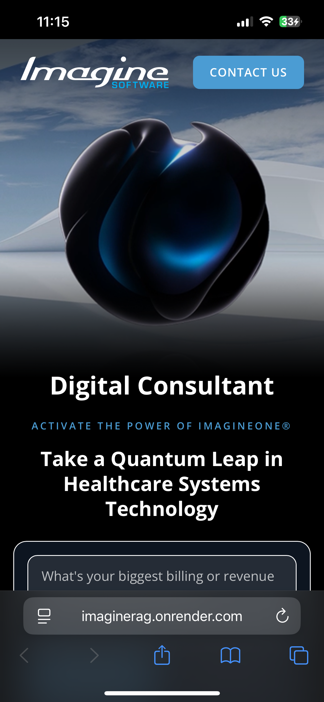
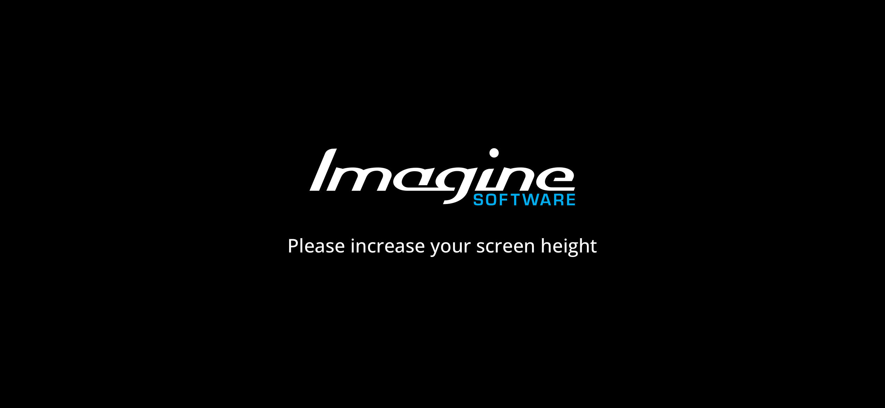

# ImagineSoftware Digital Consultant


A RAG-powered chat interface designed to simulate an initial consultation with ImagineSoftware. Potential clients can describe their business challenges and get a high-level overview of how ImagineSoftware could help based on relevant case studies and white paper references.

**Live Demo**: [https://imaginerag.onrender.com](https://imaginerag.onrender.com)

## Features

- **Stateless Chat Interface** - Clean, single-turn Q&A with 400 character limit
- **Two-Layer Guardrails** - LLM classification + embedding similarity to keep queries on-topic
- **Cohere Re-ranking** - Retrieves candidates then re-ranks for the top 6 most relevant documents
- **Streaming Responses** - Real-time response streaming via fetch with ReadableStream
- **Hero Video Background** - Responsive auto-playing video backgrounds matching the ImagineSoftware site (mobile, tablet, desktop variants)
- **Responsive Design** - Optimized layouts for mobile, tablet, and desktop with a 1400px breakpoint
- **Call-to-Action Links** - Direct links to ImagineSoftware home page and contact pages

## Tech Stack

- **Framework**: Next.js 15, React 19, TypeScript
- **Vector Database**: Qdrant (cloud)
- **Embeddings**: OpenAI `text-embedding-3-small` (512 dimensions)
- **LLM**: OpenAI GPT-4o
- **Re-ranking**: Cohere `rerank-english-v3.0`
- **Observability**: Helicone
- **Styling**: TailwindCSS
- **Hosting**: Render

## Getting Started

### 1. Install Dependencies

```bash
npm install
```

### 2. Configure Environment Variables

Create a `.env` file with your API keys (do not include quotes in values):

```bash
OPENAI_API_KEY=your_openai_api_key
QDRANT_URL=your_qdrant_cluster_url
QDRANT_API_KEY=your_qdrant_api_key
COHERE_RERANK_API=your_cohere_api_key
HELICONE_API_KEY=your_helicone_api_key
```

Required keys:
- `OPENAI_API_KEY` - For embeddings and chat completions
- `QDRANT_URL` - Your Qdrant cluster URL
- `QDRANT_API_KEY` - Your Qdrant API key
- `COHERE_RERANK_API` - For re-ranking search results
- `HELICONE_API_KEY` - For API observability (optional but recommended)

### 3. Prepare Your Documents

Add your documents to the appropriate files:

**Case Studies** - `app/scripts/data/case_studies.json`:
```json
[
  {
    "documentType": "case_study",
    "title": "Case Study Title",
    "client": "Client Name",
    "clientDescription": "Description of the client...",
    "clientDetails": ["Detail 1", "Detail 2"],
    "location": "City, State",
    "challenge": "Brief challenge summary",
    "challengeDescription": "Detailed challenge description...",
    "challengeDetails": ["Challenge 1", "Challenge 2"],
    "solution": "Brief solution summary",
    "solutionDetails": ["Solution detail 1", "Solution detail 2"],
    "result": "Brief result summary",
    "resultDetails": ["Result 1", "Result 2"]
  }
]
```

**White Papers** - `app/scripts/data/white_papers.json`:

White papers are chunked by section for more granular retrieval:
```json
[
  {
    "documentType": "white_paper",
    "title": "White Paper Title",
    "subtitle": "Topic Area",
    "theme": "Main theme description",
    "year": "2025",
    "executiveSummary": "Overview of the white paper...",
    "sections": [
      {
        "sectionTitle": "Section Title",
        "sectionType": "overview|policy|regulation|technology|outlook",
        "content": "Section content...",
        "keyPoints": ["Point 1", "Point 2"],
        "quotes": ["Notable quote"]
      }
    ],
    "keyTakeaways": "Summary takeaway message"
  }
]
```

### 4. Upload Documents to Qdrant

```bash
npm run upload-documents
```

This will:
- Create the `imagineSoftware` collection if it doesn't exist
- Generate embeddings for each document
- Upload to Qdrant with metadata

### 5. Run the Development Server

```bash
npm run dev
```

Visit [http://localhost:3000](http://localhost:3000)

## Core Project Structure

```
app/
├── agents/
│   ├── rag.ts                  # Main RAG agent with retrieval tool
│   └── types.ts                # TypeScript types for documents
├── api/
│   ├── chat/                   # Main chat endpoint (with rate limiting)
│   └── guardrail/              # Query validation endpoint (with rate limiting)
├── components/
│   ├── ChatInput.tsx           # Input form with textarea and buttons
│   ├── ChatMessages.tsx        # Message list with markdown rendering
│   ├── Hero.tsx                # Hero section with responsive video backgrounds
│   └── types.ts                # Shared TypeScript types
├── libs/
│   ├── cohere.ts               # Cohere re-ranking client
│   ├── openai.ts               # OpenAI client configuration
│   ├── qdrant.ts               # Qdrant client
│   ├── rate-limit.ts           # Rate limiting middleware
│   └── utils.ts                # Utility functions
├── scripts/
│   ├── data/
│   │   ├── case_studies.json   # Case studies
│   │   └── white_papers.json   # White papers
│   └── upload-documents.ts     # Upload script
├── config.ts                   # Centralized configuration
├── globals.css                 # Global styles
├── layout.tsx                  # Root layout
└── page.tsx                    # Main chat UI
```

## API Endpoints

### POST /api/guardrail
Validates if a query is on-topic for ImagineSoftware's services. Includes rate limiting.

### POST /api/chat
Main chat endpoint. Streams RAG-powered responses. Includes rate limiting.

## Configuration

All configuration is centralized in `app/config.ts`:

**Guardrail Settings:**
- `CONFIDENCE_THRESHOLD`: 4 (LLM confidence score minimum)
- `SIMILARITY_THRESHOLD`: 0.4 (Embedding cosine similarity minimum)

**Re-ranking Settings:**
- Retrieves top 14 candidates from Qdrant (4 case studies, 10 white paper chunks)
- Re-ranks to top 6 with Cohere (1 case study, 5 white paper chunks)

**Rate Limiting:**
- 20 requests per minute per IP address
- Returns 429 with `Retry-After` header when exceeded
- Includes `X-RateLimit-*` headers in all responses

**Chat Input:**
- Maximum 400 characters per message
- Character counter appears at 320+ characters

## Responsive Design

The app is fully responsive across all screen sizes, with tailored layouts at three breakpoints:

- **Mobile (<768px)** - Portrait-optimized video background, stacked layout with centered hero text and full-width chat input
- **Tablet (768px - 1399px)** - Mid-resolution video, horizontal nav with centered "Digital Consultant" title
- **Desktop (1400px+)** - Full 1920x1080 hero video, left-aligned headline with flex-grow layout



### Minimum Height Protection

At viewport heights below 500px, the app displays a branded fallback screen prompting the user to increase their screen height. This is primarily to ensure the user has a better experience, but it also prevents any potentially malicious behaviour. For example, if someone shrinks their browser window to take a misleading screenshot of a broken layout, the app simply won't render.


